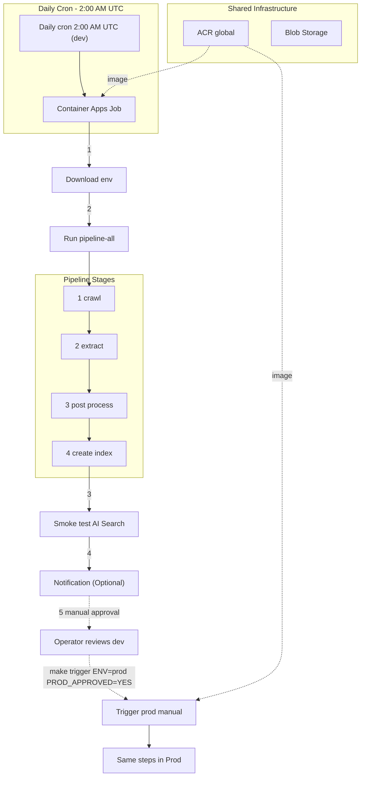

# Kioskbot ETL

This repository contains the code for ETL pipeline of the Kioskbot Project that crawls customer websites, extracts content, enriches it with keywords and questions via Azure OpenAI, and indexes it into Azure AI Search as a scheduled job inside an Azure container.


## Architecture




The infrastructure is the same for both dev and prod environments. However the respective `env` file is applied during the provisioning of the job for `dev` and `prod` respectively. 

The job for `dev` is triggered daily at the specified time. Within the job, the smoke tests are performed. 
The smoke tests results are viewable inside the logs. In the future, further evaluation steps will be added. If the results are satisfactory, the `prod` job can be manually triggered. The separation of `dev` and `prod` jobs is done to ensure quality of the index created to minimise the disruption.  


## Project Structure
<details>
<summary>Click to expand</summary>

```
src/etl_crawler/
├── config.py              # ETLSettings (bootstrap) + AppSettings (app secrets)
├── pipeline.py            # RunContext dataclass + run_pipeline() orchestrator
├── __main__.py            # CLI: python -m src.etl_crawler run --customer quality
├── spiders/
│   └── link_spider.py     # Scrapy CrawlSpider — collects URLs and PDF links
├── steps/
│   ├── crawl.py           # Step 1: run spider → url_list.jsonl
│   ├── extract.py         # Step 2: URL + PDF extraction → content.jsonl
│   ├── post_process.py    # Step 3: enrich via Azure OpenAI → processed_data.xlsx
│   └── index.py           # Step 4: build Azure AI Search index
├── customer_configs/      # Per-customer crawl rules (YAML)
│   ├── quality.yml
│   └── innovation.yml
scripts/
└── copy_secrets_from_container.py   # Download .env files from Azure Blob Storage
└── smoke_test.py   # Validate AI Search indexes are healthy.
tests/
├── test_crawl.py
├── test_extract.py
├── test_post_process.py
├── test_index.py
├── test_pipeline.py
└── benchmarks/
    └── test_index_quality.py        # Future: RAG quality benchmarks
```

Each step exposes a `run(run_context: RunContext)` function that receives a shared context (customer name, data directory, YAML config, app settings) and returns a typed result. Steps are independently testable and can be run individually or as a full pipeline.
</details>

## Prerequisite

<details>
<summary>Click to expand</summary>

- Python 3.12.11
- Azure CLI (`az login`) for downloading secrets from Azure Blob Storage

</details>

## Configure the Python environment

<details>
<summary>Click to expand</summary>

Install `uv`:

```bash
pip install uv==0.8.14
```

Create virtual environment:

```bash
uv venv .venv --python 3.12.11
```

Activate:

```bash
source .venv/bin/activate
```

Install dependencies:

```bash
uv pip install -r pyproject.toml
```

Install pre-commit hooks:

```bash
pre-commit install
```

</details>

## Configure the Environment Variables

<details>
<summary>Click to expand</summary>

There are three levels of environment variables in this project:

1. **`.env.etl`** — Bootstrap settings and Azure infrastructure references. Copy `.env.etl.example` to `.env.etl` and populate:

    | Variable | Description | Where to find it |
    |---|---|---|
    | `AZURE_STORAGE_ACCOUNT_PRIMARY_CONNECTION_STRING` | Connection string for the storage account holding secrets | Azure Portal → Global Resource Group Storage Account|
    | `AZURE_CONTAINER_STORAGE_NAME` | Blob container for logs (`kioskbot-logs`) | Global Resource Group Storage Account Access Keys  |
    | `AZURE_CONTAINER_STORAGE_SECRETS_NAME` | Blob container for secret files (`kioskbot-secrets`) | Global Resource Group Storage Account Access Keys |
    | `AZURE_CONTAINER_STORAGE_ETL_FILES_NAME` | Blob container for ETL outputs and intermediate files (`kioskbot-etl-files`) | Global Resource Group Storage Account Access Keys |
    | `CUSTOMER_NAME_LIST` | Space-separated customer names (`quality innovation`) | Matches YAML configs in `customer_configs/` |
    | `AZURE_ETL_RESOURCE_GROUP_NAME` | Resource group for the ETL infrastructure | Azure Portal |
    | `AZURE_CONTAINER_REGISTRY_NAME` | Existing ACR name | Azure Portal → Container registries |
    | `AZURE_CONTAINER_REGISTRY_LOGIN_SERVER` | ACR login server (e.g. `crkbglobal001.azurecr.io`) | Azure Portal → Container registries → Login server |
    | `AZURE_RESOURCE_GROUP_LOCATION` | Azure region (e.g. `switzerlandnorth`) | — |
    | `AZURE_CONTAINER_APP_ENV_NAME` | Container Apps Environment name | Chosen at provision time |
    | `WEBHOOK_URL` | *(Optional)* Microsoft Teams or Slack incoming webhook URL for pipeline notifications. Create one in Teams via **channel settings → Connectors → Incoming Webhook**, copy the URL, and paste it here. Leave empty to skip notifications. | Teams channel settings |

2. **`.env.dev.app`** — App secrets for the dev environment. Downloaded from Azure:

    ```bash
    make copy-secrets-from-container ENV=dev
    ```

3. **`.env.prod.app`** — App secrets for the prod environment. Downloaded from Azure:

    ```bash
    make copy-secrets-from-container ENV=prod
    ```

The bootstrap script (`scripts/copy_secrets_from_container.py`) uses the connection string in `.env.etl` to authenticate with Azure Blob Storage, downloads the `.env.{ENV}` file from the `kioskbot-secrets` container, and saves it locally as `.env.{ENV}.app`.

</details>

## Running the Pipeline Locally

<details>
<summary>Full pipeline (all 4 steps)</summary>

```bash
make pipeline customer_name=quality ENV=dev
```

This runs: crawl -> extract -> post_process -> index for a given customer.

To run the full pipeline for all customers, use

```bash
make pipeline-all-customers ENV=dev
```

### Individual step groups

**Scrape** (crawl + extract):

```bash
make scrape customer_name=quality ENV=dev
```

1. The Scrapy spider follows the rules defined in `src/etl_crawler/customer_configs/quality.yml`, collecting URLs and PDF links into `url_list.jsonl`
2. Each URL is visited with Playwright (expanding accordions/tabs), and PDFs are downloaded and parsed. All content is written to `quality_content.jsonl`

**Post-process only:**

```bash
make post-process customer_name=quality ENV=dev
```

Reads `quality_content.jsonl`, filters short/empty content, generates keywords and example questions via Azure OpenAI, and writes `processed_data.xlsx`.

**Index only:**

```bash
make index customer_name=quality ENV=dev
```

Reads `processed_data.xlsx`, chunks documents with `SemanticChunker`, generates embeddings and titles, creates the Azure AI Search index `kb-quality`, and uploads all chunks.

**Post-process + index together:**

```bash
make etl customer_name=quality ENV=dev
```

</details>


<details>
<summary>Using the Python CLI directly</summary>

```bash
PYTHONPATH=. python -m src.etl_crawler run --customer quality
PYTHONPATH=. python -m src.etl_crawler run --customer quality --steps crawl,extract
PYTHONPATH=. python -m src.etl_crawler run --customer quality --steps post_process,index
PYTHONPATH=. python -m src.etl_crawler run --customer quality --data-dir data/quality/1234567890
```

### Notes

- The crawler config per customer is in `src/etl_crawler/customer_configs/{customer_name}.yml`
- Data artifacts are written to `data/{customer_name}/{timestamp}/` (gitignored)
- Index naming convention: `kb-{customer_name}` (e.g. `kb-quality`, `kb-innovation`)
- The pipeline does not handle scanned PDFs without a text layer

</details>

## Running Tests

<details>
<summary>Click to expand </summary>

### All tests:

```bash
make test
```

Skip benchmark tests (faster, no Azure required):

```bash
make test-quick
```
</details>

## Linting

<details>
<summary>Click to expand </summary>

```bash
make lint
```

</details>

## Provisioning and Deployment

The pipeline is deployed to Azure as two **Container Apps Jobs**:

- **dev job**: scheduled daily via cron
- **prod job**: manual trigger after dev validation


### Configuration

All Azure references are read from `.env.etl` in `Makefile` using:

```make
$(shell grep '^VAR=' .env.etl | cut -d '=' -f2-)
```

Required `.env.etl` keys:

- `AZURE_STORAGE_ACCOUNT_PRIMARY_CONNECTION_STRING`
- `AZURE_CONTAINER_STORAGE_NAME`
- `AZURE_CONTAINER_STORAGE_SECRETS_NAME`
- `AZURE_CONTAINER_STORAGE_ETL_FILES_NAME`
- `CUSTOMER_NAME_LIST`
- `AZURE_ETL_RESOURCE_GROUP_NAME`
- `AZURE_CONTAINER_REGISTRY_NAME`
- `AZURE_CONTAINER_REGISTRY_LOGIN_SERVER`
- `AZURE_RESOURCE_GROUP_LOCATION`
- `AZURE_CONTAINER_APP_ENV_NAME`
- `WEBHOOK_URL` (optional)

The ETL artifact container configured by `AZURE_CONTAINER_STORAGE_ETL_FILES_NAME` is created automatically by the pipeline if it does not already exist.

Image and job naming are derived from `pyproject.toml`:

- `PROJECT_NAME` = `name` (e.g. `kioskbot-etl`)
- `VERSION` = `version` (e.g. `0.1.0`)
- Job names = sanitized and truncated `{PROJECT_NAME}-{VERSION}-dev|prod` (e.g. `kioskbot-etl-0-1-0-dev`)
- Image tag = `{ACR_LOGIN_SERVER}/{PROJECT_NAME}:{VERSION}` (e.g. `crkbglobal001.azurecr.io/kioskbot-etl:0.1.0`)

### Deploy Container
The container image needs to be present beforehand as this is needed during the provisioning of the job (not infra)

1. Build/push image first:

```bash
make docker-build-image
```
2. Push Image

```bash
make docker-build-image
make docker-push-image ACR_USERNAME="<acr-user>" ACR_PASSWORD="<acr-password>"
```

### Provisioning Steps

1. Azure CLI installed and logged in (`az login`)
2. Configure the Environment Variables as described in [Configure the Environment Variables](#configure-the-environment-variables) section.
3. Provision the resource group and the container group (once only):

  ```bash
  make provision-rg
  make provision-infra
  ```

### Testing Steps

To be implemented


### Create/ Update Crawl Jobs

1. Before updating any job, first build and push the latest image from the [Deploy Container](#deploy-container) section.

2. Update **dev** job (scheduled):
  ```bash
  make provision-dev ACR_USERNAME="<acr-user>" ACR_PASSWORD="<acr-password>"
  ```
   This command automatically stops and deletes older `*-dev` jobs from previous versions before creating the new one. This command also authenticates to the ACR to pull the image.
3. Verify dev job configuration:
  ```bash
  make job-name ENV=dev
  make job-trigger ENV=dev
  make job-cron ENV=dev
  ```
4. Update **prod** job (manual trigger):
  ```bash
  make provision-prod ACR_USERNAME="<acr-user>" ACR_PASSWORD="<acr-password>"
  ```
   This command automatically stops and deletes older `*-prod` jobs from previous versions before creating the new one. This command also authenticates to the ACR to pull the image.
5. Verify prod job configuration:
  ```bash
  make job-name ENV=prod
  make job-trigger ENV=prod
  make job-cron ENV=prod
  ```
  `job-cron` should be empty for prod because it is manual.
6. Trigger `dev` and observe:
  ```bash
  make trigger ENV=dev
  make logs ENV=dev
7. Review the smoke test results. If approved, go to step 8. Otherwise, fix bug and repeat steps from 1-6.
8. Trigger `prod`
  make trigger ENV=prod PROD_APPROVED=YES
  make logs ENV=prod
  ```
9. To view logs after the end of the job, KQL queries can be run on `Azure portal/<YOUR_CONTAINER_APP_JOB>/Logs` [Optional]
  1. Example query to get container level logs
    ```bash
    ContainerAppSystemLogs_CL
  | where JobName_s == 'kioskbot-etl-0-1-1-dev'
    ```
  2. Example query to get app level ephemeral logs
    ```bash
    ContainerAppConsoleLogs_CL
  | where TimeGenerated between (datetime(2026-03-04T02:00:00Z) .. datetime(2026-03-04T06:50:00Z))
  | where ContainerGroupName_s has "kioskbot-etl-0-1-1-dev"
  | project TimeGenerated, Log_s
  | order by TimeGenerated desc
    ```


**Note:** Both `provision-dev` and `provision-prod` validate that the image tag exists in ACR before creating jobs.

### Daily flow

1. **02:00 UTC** — dev job starts automatically (`Schedule`)
2. Container runs `make run-scheduled`, chaining:
   - `copy-secrets-from-container`
   - `pipeline-all-customers`
   - `smoke-test`
   - `notify`
3. Smoke tests validate dev indexes (`kb-quality`, `kb-innovation`)
4. Webhook sends a status message to Teams/Slack
5. Operator reviews dev output
6. Operator triggers prod manually:

```bash
make trigger ENV=prod PROD_APPROVED=YES
```

7. Prod job runs the same pipeline against prod services

### Key settings

- Dev job trigger: `--trigger-type Schedule --cron-expression "0 2 * * *"`
- Prod job trigger: `--trigger-type Manual`
- Job naming rule: lowercase alphanumeric + `-`, with version dots converted to dashes and base name trimmed to fit Azure's `<32` character limit after `-dev`/`-prod`
- Parallelism: `--parallelism 1`
- Replica completion count: `--replica-completion-count 1`
- Timeout: `--replica-timeout 28800` (8 hours)
- Retry: `--replica-retry-limit 1` (required by current Azure CLI for job creation)
- Resources: `--cpu 2 --memory 4Gi` (valid Consumption pairing)
- ACR: existing registry (`crkbglobal001`), no ACR provisioning target
- Secrets strategy: Storage connection string is read from `.env.etl`; ACR credentials are passed at runtime as `ACR_USERNAME` and `ACR_PASSWORD` when creating jobs
- Logging: `provision-infra` creates the Container Apps environment without a dedicated Log Analytics workspace in `.env.etl`; Azure associates platform logging with the environment as configured in Azure (see Portal / CLI docs for your subscription).


### Useful commands

| Command | Description |
|---|---|
| `make docker-build-image` | Build local Docker image (`kioskbot-etl:{VERSION}`) |
| `make docker-push-image ACR_USERNAME="..." ACR_PASSWORD="..."` | Tag and push image to ACR |
| `make provision-rg` | Create ETL resource group (idempotent) |
| `make provision-infra` | Create Container Apps environment |
| `make provision-dev ACR_USERNAME="..." ACR_PASSWORD="..."` | Create/update dev job (requires ACR credentials) |
| `make provision-prod ACR_USERNAME="..." ACR_PASSWORD="..."` | Create/update prod job (requires ACR credentials) |
| `make jobs-list` | List all Container Apps jobs in the ETL resource group |
| `make job-name ENV=dev` | Print resolved job name for `ENV` |
| `make job-show ENV=dev` | Show full job configuration for `ENV` |
| `make job-trigger ENV=dev` | Show trigger type (`Schedule` or `Manual`) |
| `make job-cron ENV=dev` | Show cron expression (empty for manual jobs) |
| `make trigger ENV=dev` | Manually start the dev job |
| `make trigger ENV=prod PROD_APPROVED=YES` | Manually start the prod job (guarded) |
| `make kill ENV=dev` | Stop all currently running dev executions |
| `make kill ENV=prod` | Stop all currently running prod executions |
| `make logs ENV=dev` | Tail dev job logs (requires `ENV=dev|prod`) |
| `make logs ENV=prod` | Tail prod job logs (requires `ENV=dev|prod`) |
| `make smoke-test ENV=dev` | Run smoke tests locally against dev indexes |
| `make destroy-job ENV=dev DESTROY_CONFIRM=YES` | Delete only dev Container Apps job |
| `make destroy-job ENV=prod DESTROY_CONFIRM=YES` | Delete only prod Container Apps job |
| `make destroy-infra DESTROY_CONFIRM=YES` | Delete Container Apps environment |
