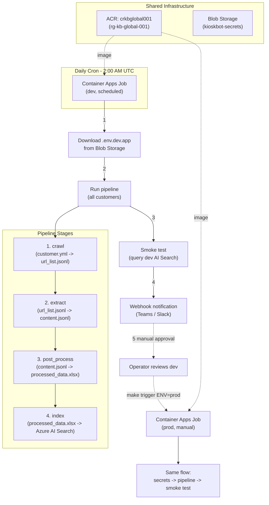

# Kioskbot ETL

This repository contains the code for ETL pipeline of the Kioskbot Project that crawls customer websites, extracts content, enriches it with keywords and questions via Azure OpenAI, and indexes it into Azure AI Search as a scheduled job inside an Azure container.

## Project Structure

```
src/etl_crawler/
├── config.py              # ETLSettings (bootstrap) + AppSettings (app secrets)
├── pipeline.py            # RunContext dataclass + run_pipeline() orchestrator
├── __main__.py            # CLI: python -m src.etl_crawler run --customer quality
├── spiders/
│   └── link_spider.py     # Scrapy CrawlSpider — collects URLs and PDF links
├── steps/
│   ├── crawl.py           # Step 1: run spider → url_list.jsonl
│   ├── extract.py         # Step 2: URL + PDF extraction → content.jsonl
│   ├── post_process.py    # Step 3: enrich via Azure OpenAI → processed_data.xlsx
│   └── index.py           # Step 4: build Azure AI Search index
├── customer_configs/      # Per-customer crawl rules (YAML)
│   ├── quality.yml
│   └── innovation.yml
scripts/
└── copy_secrets_from_container.py   # Download .env files from Azure Blob Storage
└── smoke_test.py   # Validate AI Search indexes are healthy.
tests/
├── test_crawl.py
├── test_extract.py
├── test_post_process.py
├── test_index.py
├── test_pipeline.py
└── benchmarks/
    └── test_index_quality.py        # Future: RAG quality benchmarks
```

Each step exposes a `run(run_context: RunContext)` function that receives a shared context (customer name, data directory, YAML config, app settings) and returns a typed result. Steps are independently testable and can be run individually or as a full pipeline.

## Prerequisite

<details>
<summary>Click to expand</summary>

- Python 3.12.11
- Azure CLI (`az login`) for downloading secrets from Azure Blob Storage

</details>

## Configure the Python environment

<details>
<summary>Click to expand</summary>

Install `uv`:

```bash
pip install uv==0.8.14
```

Create virtual environment:

```bash
uv venv .venv --python 3.12.11
```

Activate:

```bash
source .venv/bin/activate
```

Install dependencies:

```bash
uv pip install -r pyproject.toml
```

Install pre-commit hooks:

```bash
pre-commit install
```

</details>

## Configure the Environment Variables

<details>
<summary>Click to expand</summary>

There are three levels of environment variables in this project:

1. **`.env.etl`** — Bootstrap settings and Azure infrastructure references. Copy `.env.etl.example` to `.env.etl` and populate:

    | Variable | Description | Where to find it |
    |---|---|---|
    | `AZURE_STORAGE_ACCOUNT_PRIMARY_CONNECTION_STRING` | Connection string for the storage account holding secrets | Azure Portal → Global Resource Group Storage Account|
    | `AZURE_CONTAINER_STORAGE_NAME` | Blob container for logs (`kioskbot-logs`) | Global Resource Group Storage Account Access Keys  |
    | `AZURE_CONTAINER_STORAGE_SECRETS_NAME` | Blob container for secret files (`kioskbot-secrets`) | Global Resource Group Storage Account Access Keys |
    | `CUSTOMER_NAME_LIST` | Space-separated customer names (`quality innovation`) | Matches YAML configs in `customer_configs/` |
    | `AZURE_ETL_RESOURCE_GROUP_NAME` | Resource group for the ETL infrastructure | Azure Portal |
    | `AZURE_CONTAINER_REGISTRY_NAME` | Existing ACR name | Azure Portal → Container registries |
    | `AZURE_CONTAINER_REGISTRY_LOGIN_SERVER` | ACR login server (e.g. `crkbglobal001.azurecr.io`) | Azure Portal → Container registries → Login server |
    | `AZURE_RESOURCE_GROUP_LOCATION` | Azure region (e.g. `switzerlandnorth`) | — |
    | `AZURE_CONTAINER_APP_ENV_NAME` | Container Apps Environment name | Chosen at provision time |
    | `WEBHOOK_URL` | *(Optional)* Microsoft Teams or Slack incoming webhook URL for pipeline notifications. Create one in Teams via **channel settings → Connectors → Incoming Webhook**, copy the URL, and paste it here. Leave empty to skip notifications. | Teams channel settings |

2. **`.env.dev.app`** — App secrets for the dev environment. Downloaded from Azure:

    ```bash
    make copy-secrets-from-container ENV=dev
    ```

3. **`.env.prod.app`** — App secrets for the prod environment. Downloaded from Azure:

    ```bash
    make copy-secrets-from-container ENV=prod
    ```

The bootstrap script (`scripts/copy_secrets_from_container.py`) uses the connection string in `.env.etl` to authenticate with Azure Blob Storage, downloads the `.env.{ENV}` file from the `kioskbot-secrets` container, and saves it locally as `.env.{ENV}.app`.

</details>

## Running the Pipeline Locally

### Full pipeline (all 4 steps)

```bash
make pipeline customer_name=quality ENV=dev
```

This runs: crawl -> extract -> post_process -> index for each customer.

To run the full pipeline for all customers, use

```bash
make pipeline-all-customers ENV=dev
```

### Individual step groups

**Scrape** (crawl + extract):

```bash
make scrape customer_name=quality ENV=dev
```

1. The Scrapy spider follows the rules defined in `src/etl_crawler/customer_configs/quality.yml`, collecting URLs and PDF links into `url_list.jsonl`
2. Each URL is visited with Playwright (expanding accordions/tabs), and PDFs are downloaded and parsed. All content is written to `quality_content.jsonl`

**Post-process only:**

```bash
make post-process customer_name=quality ENV=dev
```

Reads `quality_content.jsonl`, filters short/empty content, generates keywords and example questions via Azure OpenAI, and writes `processed_data.xlsx`.

**Index only:**

```bash
make index customer_name=quality ENV=dev
```

Reads `processed_data.xlsx`, chunks documents with `SemanticChunker`, generates embeddings and titles, creates the Azure AI Search index `kb-quality`, and uploads all chunks.

**Post-process + index together:**

```bash
make etl customer_name=quality ENV=dev
```

### Using the Python CLI directly

```bash
PYTHONPATH=. python -m src.etl_crawler run --customer quality
PYTHONPATH=. python -m src.etl_crawler run --customer quality --steps crawl,extract
PYTHONPATH=. python -m src.etl_crawler run --customer quality --steps post_process,index
PYTHONPATH=. python -m src.etl_crawler run --customer quality --data-dir data/quality/1234567890
```

### Notes

- The crawler config per customer is in `src/etl_crawler/customer_configs/{customer_name}.yml`
- Data artifacts are written to `data/{customer_name}/{timestamp}/` (gitignored)
- Index naming convention: `kb-{customer_name}` (e.g. `kb-quality`, `kb-innovation`)
- The pipeline does not handle scanned PDFs without a text layer

## Running Tests

All tests:

```bash
make test
```

Skip benchmark tests (faster, no Azure required):

```bash
make test-quick
```

## Linting

```bash
make lint
```

## Provisioning and Deployment

The pipeline is deployed to Azure as two **Container Apps Jobs**:

- **dev job**: scheduled daily via cron
- **prod job**: manual trigger after dev validation

- Azure CLI installed and logged in (`az login`)
- `.env.etl` fully populated (see [Configure the Environment Variables](#configure-the-environment-variables))
- Access to the existing ACR (`crkbglobal001` in `rg-kb-global-001`)

Both jobs use the same container image. The `ENV` value (`dev` or `prod`) controls which app secrets file is loaded (`.env.dev.app` / `.env.prod.app`) and therefore which Azure Search/OpenAI endpoints are used.

### Architecture



### Configuration

All Azure references are read from `.env.etl` in `Makefile` using:

```make
$(shell grep '^VAR=' .env.etl | cut -d '=' -f2-)
```

Required `.env.etl` keys:

- `AZURE_STORAGE_ACCOUNT_PRIMARY_CONNECTION_STRING`
- `AZURE_CONTAINER_STORAGE_NAME`
- `AZURE_CONTAINER_STORAGE_SECRETS_NAME`
- `CUSTOMER_NAME_LIST`
- `AZURE_ETL_RESOURCE_GROUP_NAME`
- `AZURE_CONTAINER_REGISTRY_NAME`
- `AZURE_CONTAINER_REGISTRY_LOGIN_SERVER`
- `AZURE_RESOURCE_GROUP_LOCATION`
- `AZURE_CONTAINER_APP_ENV_NAME`
- `WEBHOOK_URL` (optional)

Image and job naming are derived from `pyproject.toml`:

- `PROJECT_NAME` = `name` (e.g. `kioskbot-etl`)
- `VERSION` = `version` (e.g. `0.1.0`)
- Job names = sanitized and truncated `{PROJECT_NAME}-{VERSION}-dev|prod` (e.g. `kioskbot-etl-0-1-0-dev`)
- Image tag = `{ACR_LOGIN_SERVER}/{PROJECT_NAME}:{VERSION}` (e.g. `crkbglobal001.azurecr.io/kioskbot-etl:0.1.0`)

### Daily flow

1. **02:00 UTC** — dev job starts automatically (`Schedule`)
2. Container runs `make run-scheduled`, chaining:
   - `copy-secrets-from-container`
   - `pipeline-all-customers`
   - `smoke-test`
   - `notify`
3. Smoke tests validate dev indexes (`kb-quality`, `kb-innovation`)
4. Webhook sends a status message to Teams/Slack
5. Operator reviews dev output
6. Operator triggers prod manually:

```bash
make trigger ENV=prod
```

7. Prod job runs the same pipeline against prod services

### Key settings

- Dev job trigger: `--trigger-type Schedule --cron-expression "0 2 * * *"`
- Prod job trigger: `--trigger-type Manual`
- Job naming rule: lowercase alphanumeric + `-`, with version dots converted to dashes and base name trimmed to fit Azure's `<32` character limit after `-dev`/`-prod`
- Timeout: `--replica-timeout 28800` (8 hours)
- Resources: `--cpu 1 --memory 4Gi`
- ACR: existing registry (`crkbglobal001`), no ACR provisioning target
- Secrets strategy: only Storage connection string is injected into the job; app secrets are pulled from Blob at runtime

### Provision and operate

One-time setup:

```bash
make provision
```

`make provision` now performs:

- `provision-rg` (creates the ETL resource group if missing)
- `provision-infra` (creates the Container Apps environment)
- `provision-dev` (creates scheduled dev job)
- `provision-prod` (creates manual prod job)

Build/push latest image:

```bash
make deploy
```

### Useful commands

| Command | Description |
|---|---|
| `make provision` | One-time: create Container Apps environment + dev/prod jobs |
| `make provision-rg` | Create ETL resource group (idempotent) |
| `make deploy` | Build and push Docker image to ACR |
| `make trigger ENV=dev` | Manually start the dev job |
| `make trigger ENV=prod` | Manually start the prod job |
| `make kill ENV=dev` | Stop all currently running dev executions |
| `make kill ENV=prod` | Stop all currently running prod executions |
| `make logs ENV=dev` | Tail dev job logs |
| `make logs ENV=prod` | Tail prod job logs |
| `make smoke-test ENV=dev` | Run smoke tests locally against dev indexes |
